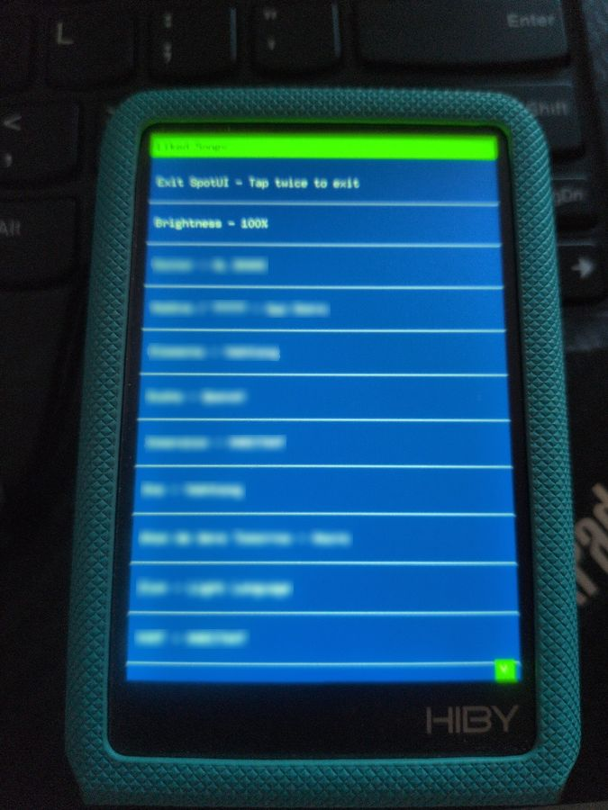

# spotui-hiby-r3proii

SpotUI for the HiBy R3 Pro II: an experimental standalone, tetherless streaming UI/client with on-device control.

> Early public source release. This is not yet a one-click install or end-user firmware package.

Optional donations support test hardware, documentation, maintenance, and continued experimentation. Nothing is paywalled.

## Screenshots

  
  

This project provides source code, scripts, and notes for running a lightweight standalone music client on HiBy devices. It is intended for device owners who want to build, study, and modify their own hardware.

This project is not affiliated with, endorsed by, or supported by HiBy Music or Spotify.

## Status

Experimental. Tested primarily on the HiBy R3 Pro II.

Current device-side features include:

- On-device browsing and playback of liked songs
- Fixed bottom toolbar with Exit, Brightness, Pause/Resume, and Refresh controls
- Persistent brightness selection
- Battery percentage display
- Automatic 3.5 mm and 4.4 mm output routing
- Header-based paging through the track list
- Track-name truncation for the compact display
- Startup retry behavior while WiFi and the playback daemon initialize

“Tetherless” means playback can be browsed and controlled directly from the HiBy instead of using it only as a receiver controlled by a phone or desktop client.

Flashing or modifying firmware can brick your device. Use at your own risk.

## What is included

- `engine/ui/` — framebuffer and touchscreen UI written in Rust using embedded-graphics.
- `engine/launcher/` — launcher script for WiFi bring-up, jack routing, UI startup, daemon supervision, and panel keepalive behavior.
- `engine/firmware/` — init scripts and firmware-side integration notes.
- `apps/spotify/daemon/` — Spotify-compatible daemon source using librespot.

## What is not included

This repository does not include:

- HiBy firmware images
- modified `.upt` firmware files
- extracted HiBy binaries
- deployed device snapshots
- Spotify credentials
- `librespot-cache/`
- WiFi credentials
- user-specific device backups
- ready-to-flash firmware builds

This source repository does not include firmware images, ready-to-flash builds, Spotify credentials, WiFi credentials, or user-specific device files. Users are responsible for any firmware, accounts, credentials, and device setup used with their own hardware.

## Repository structure

- `engine/` — reusable core components.
  - `ui/` — framebuffer/touch UI for the device.
  - `firmware/` — init scripts and firmware integration pieces.
  - `launcher/` — startup script for launching the UI and backend daemon.
- `apps/spotify/` — Spotify-compatible app built on top of the core engine.
  - `daemon/` — librespot-based control daemon source.
- `docs/` — setup, build, recovery, and device notes.

## Setup requirements

- A HiBy R3 Pro II device.
- A working ADB connection.
- A local MIPS cross-build environment for `mipsel-unknown-linux-musl`.
- A user-supplied WiFi configuration on the device.
- A user-supplied Spotify Premium account configured locally on the device.
- The HiBy backlight setting should be configured so the panel remains available during startup.

## Spotify note

SpotUI does not use the Spotify Web API. It uses librespot, an open-source Spotify Connect client library, for Spotify-compatible playback.

Do not commit Spotify credentials, cache files, tokens, WiFi credentials, firmware images, or device snapshots to this repository.

## Disclaimer

This is an independent community research/modding project. It is provided without warranty. You are responsible for your own device, accounts, firmware, and compliance with applicable laws and service terms.

## Project documents

- [Roadmap](docs/roadmap.md)
- [Recovery notes](docs/recovery.md)

- [Disclaimer](DISCLAIMER.md)
- [Support policy](SUPPORT.md)
- [Third-party components](THIRD_PARTY.md)
- [License](LICENSE)

